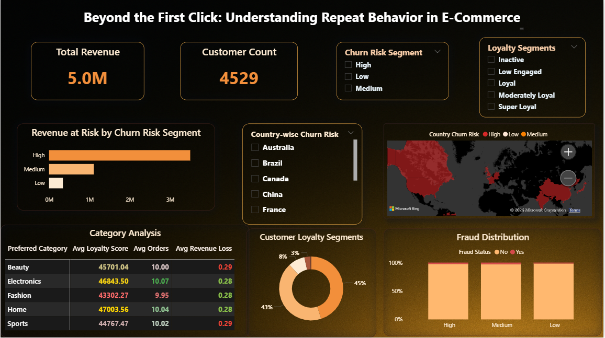

# Beyond the First Click: A Power BI Deep Dive into Repeat Behavior in E-Commerce

## TL;DR
This project examines repeat customer behavior in an e-commerce environment using a comprehensive data analytics approach, incorporating SQL for segmentation logic, Excel for data preprocessing, and Power BI for the dashboard. Through behavioral cohorting, churn segmentation, and fraud pattern detection, the analysis identifies key revenue risks and high-value customer groups, informing the retention strategy.

## Table of Contents
 * [Project Objective](#project-objective)
 * [Background](#background)
 * [Tools Used](#tools-used)
 * [Customer Overview](#customer-overview)
 * [Dashboard Preview](#dashboard-preview)
 * [SQL Queries Preview](#sql-queries-preview)
 * [Key Insights & Business Impact](#key-insights--business-impact)
 * [Project Structure](#project-structure)
 * [Case Study: Behind the Queries](#case-study-behind-the-queries)
 * [Sample Analytical Techniques](#sample-analytical-techniques)
 * [Why This Project Matters](#why-this-project-matters)
 * [Let's Connecct](#lets-connect)

## Project Objective
To investigate customer retention patterns and repeat purchasing behavior in a simulated e-commerce setting, to identify drivers of loyalty, risk clusters, and category-specific retention performance. The project emphasizes end-to-end data ownership, from raw modeling to strategic insight delivery.

## Background
While acquisition metrics often receive the spotlight, long-term profitability hinges on retention. This project seeks to answer: 
*Who returns, who churns, and what distinguishes the two?*
Using a relational dataset of 4,500+ customers, I built a behavioral segmentation model and layered it with fraud analysis, category-level trends, and revenue risk heatmaps to drive business-focused recommendations. 

## Tools Used
 * **SQL**: Data modeling, cohort segmentation, churn & fraud logic
 * **Microsoft Excel**: Data cleaning and structured validation
 * **Power BI**: Dashboard design, interactivity, storytelling

## Customer Overview
```markdown
|Metric                  |Value       |
|------------------------|------------|
|Total Customers         | 4529       |
|Average Age             | 48.1 Years |
|Number of Countries     | 10         |
|Average Order Value     | 108.54     |
|Average Orders/Customer | 10.02      |
```
## Dashboard Preview
A visual snapshot of the Power BI dashboard is available in the repository. It presents customer segmentation, repeat behavior patterns, fraud indicators, and revenue-at-risk, all within a user-friendly, interactive interface tailored for stakeholder review.



## SQL Queries Preview
The following section provides a high-level view of the core SQL logic used in the analysis. From churn segmentation to fraud clustering and revenue cohorting, these queries represent the foundation of the insights delivered.

```sql
-- This is a SQL code block
WITH CRM AS (
 SELECT Preferred_Category,
 ROUND(AVG(Loyalty_Score), 2) AS Avg_Loyalty_Score,
 ROUND(AVG(Total_Orders), 2) AS Avg_Orders,
 ROUND(AVG(Churn_Risk), 2) AS Avg_Revenue_Loss
FROM ecommerce_table
GROUP BY Preferred_Category
)
SELECT
e.Customer_Id,
e.Country,
e.Total_Orders,
 CASE
  WHEN e.Total_Orders BETWEEN 15 AND 19 THEN 'Super Loyal'
  WHEN e.Total_Orders BETWEEN 10 AND 14 THEN 'Loyal'
  WHEN e.Total_Orders BETWEEN 5 AND 9 THEN 'Moderately Loyal'
  WHEN e.Total_Orders BETWEEN 1 AND 4 THEN 'Low Engaged'
 ELSE 'Inactive'
END AS Loyalty_Segment,
ROUND(e.Avg_Order_Value * e.Total_Orders, 2) AS Total_Revenue,
 CASE
  WHEN (Avg_Order_Value * Total_Orders) >= 1000 THEN 'High'
  WHEN (Avg_Order_Value * Total_Orders) >= 500 THEN 'Medium'
 ELSE 'Low'
END AS Churn_Risk_Segment,
 CASE
  WHEN e.Is_Fraudulent = 1 THEN 'Yes'
  ELSE 'No'
END AS Fraud_Status,
e.Preferred_Category,
c.Avg_Loyalty_Score,
c.Avg_Orders,
c.Avg_Revenue_Loss
FROM ecommerce_table e
LEFT JOIN CRM c
 ON e.Preferred_Category = c.Preferred_Category
WHERE e.Country IS NOT NULL;
```

## Key Insights & Business Impact
### Retention Segments
 * **Loyal Base**: 45% of customers consistently repeat; 30% show moderate loyalty.
 * **Super Loyal**: 9% of customers contribute disproportionately to revenue; this group merits focused retention programs.

### Revenue Risk
 * $3.49M in sales (43% of total revenue) is tied to **High Churn Risk**segments.
 * These segments require urgent lifecycle marketing interventions to avoid revenue leakage.

### Fraud Clustering
 * High churn cohorts show a disproportionate rate of fraud incidents, signaling the need for targeted risk analysis and operational controls.

### Category-Level Trends
 * **Home** & **Sports** categories show stronger repeat behavior and higher customer stickiness.
 * **Fashion** delivers strong top-line revenue but lacks customer retention, indicating impulse-driven purchases or poor product-market fit. 

## Project Structure 

|Folder File                  | Description                   |
|-----------------------------|-------------------------------|
| `Dashboard Screenshot`      | A screenshot of the dashboard |
| `Power BI (.pbix) file`     | Dashboard and Data View       |
| `SQL Queries`               | Sql queries written           |
| `Case Study`                | In-depth of the project       |
| `README.md`                 | This file                     |

## Case Study: Behind the Queries
Explore the full case study for a structured narrative of the business context, technical implementation, and key takeaways. This includes SQL methodology, visual design choices, and the logic driving stakeholder recommendations.

[View the full case study here](https://docs.google.com/document/d/1QslwGDxt7Uj1MzdJjwGdME_j7KGeKJMZOj6Lu6rDnZg/edit?usp=sharing)

```markdown
## Sample Analytical Techniques
 * Cohort Segmentation: Defined customers into loyalty bands based on recency and frequency logic via SQL.
 * Fraud Detection Layer: Mapped fraud incidents across churn risk levels to assess correlation.
 * Revenue Attribution: Used conditional logic to bucket revenue by customer behavior for financial modeling.
 * Category Behavioral Matrix: Cross-referenced category affinity with loyalty scores to guide merchandising decisions.
```

## Why This Project Matters
In many firms, loyalty analytics is either underbuilt or overly reliant on third-party dashboards. This case study illustrates: 
 * Ownership of the **entire analytics pipeline**, from raw data to insight delivery.
 * Clear business-aligned recommendations based on behavioral segmentation
 * Strong storytelling through **interactive dashboards** not just charts, but decision enablers

This approach is especially relevant for mid-stage companies or retention-focused product teams seeking to operationalize customer insights with limited tooling. 

## What I'd Explore Next
 * **LTV Prediction Modeling**: Estimate customer lifetime value based on observed purchase patterns
 * **Retention Marketing Simulation**: Model uplift scenarios based on loyalty program tweaks
 * **Post-Churn Winback**: Identify common traits among customers who returned after churn

## Let's Connect
I'm actively building tools to uncover workplace insights through data. Feel free to reach out via: 
* [GitHub](https://github.com/Shrey0561)
* [LinkedIn](https://www.linkedin.com/in/shreya-srinath-879a66205/)
* [Notion](https://www.notion.so/Data-Analyst-Portfolio-221ebe151fdd801e9445e32590b67758?source=copy_link)

I'm always up for conversations or new opportunities!

